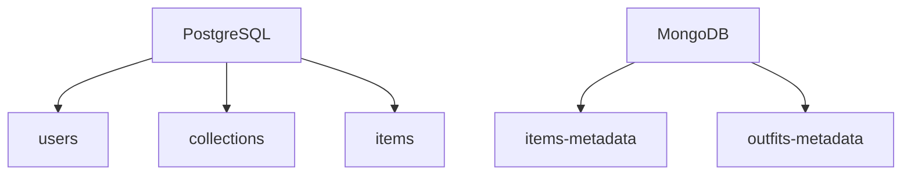

# Closet Management App MVP Plan Document

## 1. Executive Summary
This document outlines the technical and functional plan for developing the Closet Management App Minimum Viable Product (MVP). The solution focuses on core clothing item management, outfit creation, and collection organization, leveraging modern web technologies with a scalable architecture for future expansion.

## 2. Objectives
- Create a user-friendly interface for managing clothing items and outfits
- Implement core features for organizing collections and tracking usage
- Establish a scalable technical foundation for future AI integration and analytics
- Ensure secure, efficient, and maintainable architecture

## 3. Core Features Implementation
### 3.1 Clothing Item Management
- **Frontend**: React components for item upload with metadata forms
- **Backend**: FastAPI endpoints for CRUD operations with Pydantic validation
- **Database**: PostgreSQL for structured data storage
- **Image Handling**: Use Fabrica API for background removal and store metadata in MongoDB

### 3.2 Outfit Creation
- **Frontend**: Drag-and-drop interface with React DnD library
- **Backend**: FastAPI endpoint for storing outfit metadata (position, rotation)
- **Database**: MongoDB for unstructured outfit metadata
- **Image Generation**: Static image export with metadata storage

### 3.3 Collection Management
- **Frontend**: UI for grouping items/outfits with filters/sorting
- **Backend**: FastAPI endpoints for collection management
- **Database**: PostgreSQL for relational collection data

## 4. Technical Stack Implementation
### 4.1 Frontend
- **Framework**: React + Redux Toolkit for state management
- **Routing**: React Router for navigation
- **Authentication**: OAuth2.0 integration with GitHub/Google

### 4.2 Backend
- **Framework**: FastAPI with async/await for non-blocking I/O
- **Database**: PostgreSQL (users, authentication) + MongoDB (metadata)
- **Security**: JWT tokens stored in localStorage

### 4.3 DevOps
- **Containerization**: Docker + Docker Compose for frontend/backend
- **CI/CD**: GitHub Actions for automated testing/deployment
- **Monitoring**: Docker metrics for container health

## 5. Development Roadmap
**Phase 1: API Development (Weeks 1-2)**  
- Define RESTful endpoints for clothing items, outfits, collections  
- Implement Pydantic models for data validation  
- Set up PostgreSQL and MongoDB with Docker  

**Phase 2: Frontend Development (Weeks 3-4)**  
- Build React components for item management and outfit creation  
- Implement OAuth2.0 authentication flow  
- Develop drag-and-drop interface with React DnD  

**Phase 3: Backend Implementation (Weeks 5-6)**  
- Complete FastAPI endpoints for CRUD operations  
- Implement database interactions with asyncpg/motor  
- Set up JWT authentication middleware  

**Phase 4: Testing & CI/CD (Weeks 7-8)**  
- Write unit/integration tests for all components  
- Configure GitHub Actions for automated testing  
- Set up Docker Compose for local development  

## 6. Security Measures
- Data encryption for sensitive fields  
- Audit logs for user actions  
- Role-based access control (RBAC) for collections  
- Secure JWT token storage in localStorage  

## 7. Data Architecture


## 8. Success Metrics
- 95% core feature implementation  
- 100% API endpoint coverage  
- 90% unit test coverage  
- Successful Docker Compose integration  
- GitHub Actions CI/CD pipeline

## 9. Work Breakdown Structure (WBS)
### 1. Project Structure Setup and Technology Setup
Tasks: 
#### 1.1 Create the following directory structure with all required files:

```
ClosetManager/
├── frontend/                # React application
│   ├── public/              # Static assets
│   ├── src/                 # Main source files
│   │   ├── app/             # React components
│   │   ├── api/             # API calls
│   │   ├── store/           # Redux Toolkit
│   │   ├── router/          # React Router config
│   │   └── index.js         # Entry point
│   ├── package.json         # Frontend dependencies
│   └── .gitignore           # Frontend-specific ignores
│
├── backend/                 # FastAPI application
│   ├── app/                 # Main FastAPI files
│   │   ├── main.py          # Entry point
│   │   ├── routers/         # API endpoints
│   │   ├── models/          # Pydantic models
│   │   └── dependencies.py  # Middleware
│   ├── tests/               # Unit/integration tests
│   ├── requirements.txt     # Backend dependencies
│   └── .env.example         # Environment variables
│
├── db/                      # Database configurations
│   ├── postgres/            # PostgreSQL setup
│   │   └── init.sql         # Initial schema
│   └── mongodb/             # MongoDB setup
│       └── init.js          # Initial schema
│
├── docker-compose.yml       # Docker orchestration
├── .github/                 # GitHub Actions CI/CD
│   └── workflows/           # CI/CD pipelines
│
├── config/                  # Configuration files
│   └── .env.example         # Example environment variables
│
├── tests/                   # Shared test utilities
├── setup.sh                 # Setup script (optional)
├── README.md                # Project overview
└── mvp-plan.md              # This document
```

#### 1.2. Technology Setup
1.2.1. **Frontend**:  
   - Initialize React app: `npx create-react-app frontend`  
   - Install Redux Toolkit: `npm install @reduxjs/toolkit`  
   - Configure React Router: `npm install react-router-dom`  
   - Add React DnD for drag-and-drop: `npm install react-dnd react-dnd-html5-backend`  
   - Set up image processing with Fabrica API integration  
   - Configure `react-app-env` for environment variables

1.2.2. **Backend**:  
   - Create FastAPI app: `uvicorn --version` to verify installation  
   - Install dependencies: `pip install fastapi pydantic asyncpg motor`  
   - Configure JWT authentication with `fastapi-users` or `authlib`  
   - Implement Pydantic models for data validation  
   - Set up async/await for non-blocking I/O operations  
   - Configure database connections in `app/main.py`  

1.2.3. **Database**:  
   - Set up PostgreSQL with `psql` and create `init.sql`  
   - Initialize MongoDB with `mongosh init.js`  
   - Configure connection strings in `.env.example`  
   - Use `asyncpg` for PostgreSQL connections  
   - Use `motor` for MongoDB connections  
   - Implement database migrations with Alembic  

1.2.4. **Docker**:  
   - Create `docker-compose.yml` with services for:  
     - Frontend (React)  
     - Backend (FastAPI)  
     - PostgreSQL  
     - MongoDB  
   - Use `docker-compose up` to start containers  
   - Create `Dockerfile` for each service with proper build context  
   - Configure volume mounts for development 

1.2.5. **CI/CD**:  
   - Create GitHub Actions workflows in `.github/workflows/`  
   - Configure testing with `pytest` and Docker containers  
   - Set up deployment pipeline for production  
   - Use `docker-compose` for local testing 
   
1.2.6. **Environment Variables**:
  - Setup any environment variables we will need for the various systems
  
### 2. Authentication and User Management
Tasks:
#### 2.1. Implement OAuth2.0 Authentication  
- Integrate GitHub and Google OAuth2.0 providers  
- Implement redirect URI handling and token exchange  
- Store user credentials securely using JWT  
- Set up `fastapi-users` or `authlib` for authentication middleware  

#### 2.2. User Profile Management  
- Create user profile endpoints for reading/writing user data  
- Implement user profile UI for frontend display and editing  
- Add profile image upload and storage functionality  
- Store user metadata (preferences, collections, etc.) in PostgreSQL  

#### 2.3. Role-Based Access Control (RBAC)  
- Define user roles: `User`, `Admin`  
- Implement middleware for checking permissions  
- Enforce RBAC on collection-level endpoints  
- Set up audit logs for user actions  

### 3. Clothing Item Management
Tasks:
#### 3.1. Clothing Item Upload and Storage  
- Implement frontend form for uploading images with metadata  
- Use Fabrica API for background removal and image optimization  
- Store structured data in PostgreSQL and unstructured metadata in MongoDB  
- Implement image caching and compression strategies  

#### 3.2. Clothing Item CRUD Operations  
- Create FastAPI endpoints for creating, updating, and deleting items  
- Implement Pydantic models for item validation  
- Set up database relationships between items and collections  
- Implement search and filtering capabilities for items  

### 4. Outfit Creation and Management
Tasks:
#### 4.1. Outfit Creation UI  
- Implement drag-and-drop functionality for item placement  
- Add support for rotating and resizing items within the UI  
- Allow users to save and name outfits  
- Store outfit metadata (item positions, rotations) in MongoDB  

#### 4.2. Outfit Export and Sharing  
- Implement static image export for outfits  
- Create endpoints for exporting outfits as images or JSON  
- Add sharing capabilities via link or social media  
- Store exported images in a cloud storage solution (e.g., AWS S3)  

### 5. Collection Management
Tasks:
#### 5.1. Collection Creation and Organization  
- Implement UI for creating and naming collections  
- Allow users to sort, filter, and group items by category, color, etc.  
- Create endpoints for managing collections in the backend  
- Implement relational database schema for collections and items  

#### 5.2. Collection Analytics and Insights  
- Add basic analytics for usage frequency, outfit combinations  
- Implement filtering and sorting capabilities for collections  
- Create admin dashboards for viewing collection statistics  
- Store analytics data in PostgreSQL for future expansion  

### 6. Testing and Quality Assurance
Tasks:
#### 6.1. Unit Testing  
- Write unit tests for FastAPI endpoints and Pydantic models  
- Implement integration tests for backend services  
- Create test cases for user authentication and RBAC  
- Use `pytest` for test execution and coverage reports  

#### 6.2. Frontend Testing  
- Implement Jest/React Testing Library for frontend component testing  
- Add tests for drag-and-drop functionality and image upload  
- Test UI rendering for different screen sizes and orientations  
- Use Storybook for component documentation and testing  

#### 6.3. Security Testing  
- Perform security audits for JWT token handling and database access  
- Test for SQL injection and NoSQL injection vulnerabilities  
- Implement penetration testing for the application  
- Add rate-limiting and input validation measures  

### 7. Deployment and DevOps
Tasks:
#### 7.1. Docker Containerization  
- Create Dockerfiles for frontend, backend, PostgreSQL, and MongoDB  
- Configure `docker-compose.yml` for local development  
- Set up persistent storage for databases  
- Implement Docker volume mounting for data persistence  

#### 7.2. GitHub Actions CI/CD  
- Configure automated testing pipelines for commits and PRs  
- Set up deployment workflows for staging and production  
- Implement monitoring for build and deployment statuses  
- Use GitHub Secrets for storing sensitive configuration data  

#### 7.3. Monitoring and Logging  
- Set up logging for backend services and frontend errors  
- Implement Docker health checks and metrics collection  
- Use monitoring tools for database performance and API latency  
- Add alerting for critical system failures and errors


